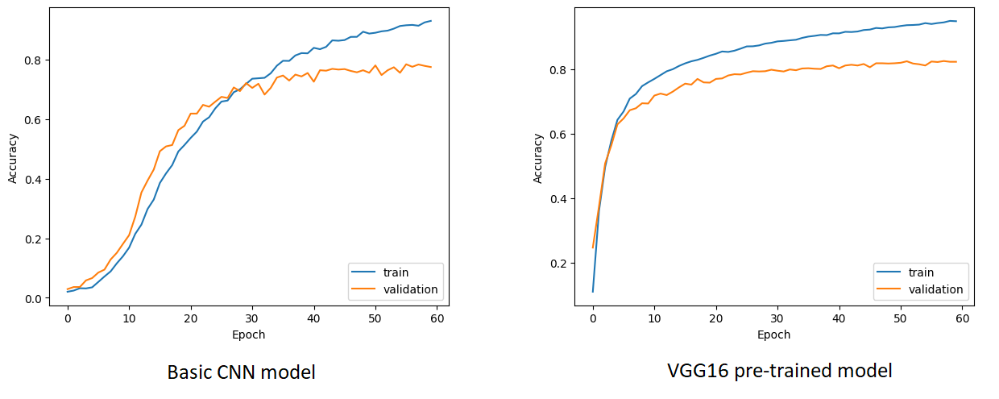

# Butterfly Image Classification

Training dataset: [Kaggle - Butterfly Image Classification](https://www.kaggle.com/datasets/phucthaiv02/butterfly-image-classification)

Medium Blog: [Butterfly Species, how much do you know?](https://medium.com/%40lx9182/butterfly-species-how-much-do-you-know-c6d81a98db0c)

In this notebook [Butterfly_Image_Classification](Butterfly_Image_Classification) we will be doing following steps do build a CNN model to classify butterfly types:

1. The Data
2. Exploratory Data Analysis
3. Image Preprocessing
4. A basic CNN model
5. Transfer Learning with VGG16

## Install libraries:

```
pip install -r requirements.txt
```

## Why do we do this project?

To explore Deep Learning skill to solve image classification problem by using CNN and also transfer learning.

## Summary result

After training 60 epochs with basic CNN and pre-trained model VGG16, here is the result:



## Licensing, Authors, Data
All belong to Kaggle: [Kaggle - Butterfly Image Classification](https://www.kaggle.com/datasets/phucthaiv02/butterfly-image-classification)